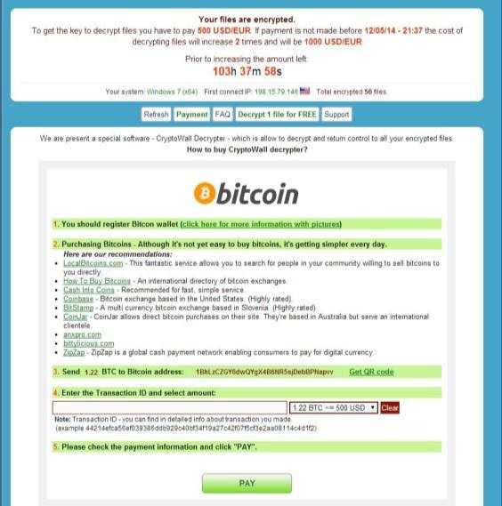

### Signes généraux de la présence d'un rançongiciel

Plusieurs pistes peuvent indiquer la compromission du syst_me par un rançongiciel :

- réception d'étranges courriels professionnels (souvent sous la forme de factures) porteurs de pièces jointes
- note de rançon affiché sur le bureau et précisant que des documents ont été chiffrés (ou cryptés) et réclamant une somme d'argent en échange

  <figure class="figure text-center w-100">
  
  <figcaption class="figure-caption">Figure 1 - Message de raçon pour Cryptowall</figcaption>
  </figure>

- plainte des utilisateurs sur des fichiers indisponibles ou corrompus, sur leur ordinateur ou sur des partages réseaux, avec des extensions de fichiers atypiques (.abc, .xyz, .aaa, ...).
- nombreux fichiers modifiés sur un très court intervale de temps sur des partages réseaux

### Identification sur le poste

- Rechercher des fichiers exécutables inhabituels dans les profils utilisateurs (`%ALLUSERSPROFILE%` ou `%APPDATA%`) et dansd `%SystemDrive%`
- Recherche les extensions ci-dessus ou des notes de rançon
- Effactuer si possible une capture de l'image mémoire du système
- Rechercher des processus inhabituels
- Rechercher des motifs atypiques dans les pièces jointes des courriels
- Rechercher une activité réseau ou de navigation web atypique, en particulier des connexions vers Tor ou I2P IP, des passerelles Tor (tor2web...) ou des sites de paiement en Bitcoin

### Identification sur le réseau

- Rechercher des motifs de connexion vers des kits d'exploit
- Rechercher des motifs de connexion vers des serveur de *Command & Control* (C&C) de rançongicies
- Rechercher une activité réseau ou de navigation web atypique, en particulier des connexions vers Tor ou I2P IP, des passerelles Tor (tor2web...) ou des sites de paiement en Bitcoin
- Rechercher des motifs atypiques dans les pièces jointes des courriels
